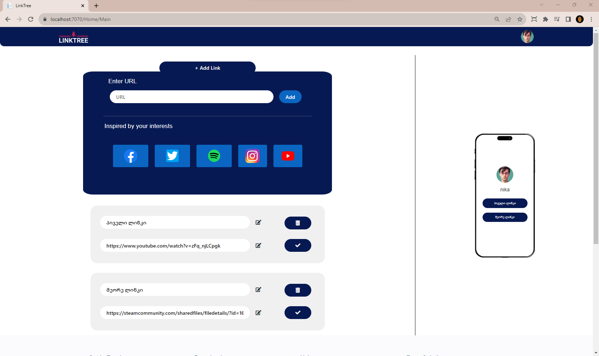

# LinkTree Clone - Your One-Stop Link Aggregator

LinkTree Clone is a comprehensive full-stack web application developed using ASP.NET and C#. This repository houses the codebase for a unique platform that offers an alternative to the well-known LinkTree service. Users can curate a personalized collection of their social media links and generate a single, concise link for easy sharing. With robust authentication, role-based authorization, and JWT token authentication, this project not only showcases your full-stack development skills but also provides a seamless and secure user experience.

## Table of Contents

- [Introduction](#introduction)
- [Features](#features)
- [Installation](#installation)
- [Usage](#usage)
- [Authentication and Authorization](#authentication-and-authorization)
- [API - LinkTreeAPI](#linktreeapi)
- [Contributing](#contributing)

## Introduction

Welcome to LinkTree Clone, a dynamic platform designed to simplify the process of sharing multiple social media links with a single, easy-to-remember link. Through this project, you'll discover the power of ASP.NET and C# in creating a user-friendly and efficient web application. LinkTree Clone not only offers practical utility but also serves as an excellent showcase of your full-stack development prowess.

## Features

- Compile and manage an array of social media links.
- Generate a unified link that provides access to all user-provided links.
- Implement secure authentication using JWT tokens.
- Assign role-based permissions to users for a personalized experience.

## Installation

Get started with LinkTree Clone by setting up the project locally. The installation process is straightforward and involves a few simple steps:

1. Clone this repository to your local machine.

## Usage

Discover how LinkTree Clone streamlines the link-sharing experience:

1. Create an account or log in if you already have one.
2. Add your social media links to your profile.
3. Generate a single link that encapsulates all your provided links.
4. Share your unified link with your audience for easy access.

## Authentication and Authorization

LinkTree Clone employs a robust authentication system, bolstered by JWT token authentication and role-based authorization. Users can securely access and manage their profiles, while administrators oversee the platform's operation.

## API - LinkTreeAPI

Refer to the [API Documentation](https://github.com/whosNikoloz/LinkTreeAPI.git) for detailed information on the endpoints provided by the LinkTreeAPI. The API offers functionalities such as adding links and generating combined links.

## Contributing

We welcome contributions from the community to enhance the LinkTree Clone project. To contribute:

1. Set up your development environment by following the guidelines in .
2. Fork this repository and create a new branch for your contribution.
3. Make your changes, ensuring adherence to coding standards.
4. Submit a pull request, detailing the purpose and scope of your changes.

Feel free to customize and expand the sections as needed to accurately reflect your LinkTree Clone project. Replace placeholders like `/path/to/banner/image` with the actual paths and tailor the content to your project's specifics. Best of luck with your LinkTree Clone project!
